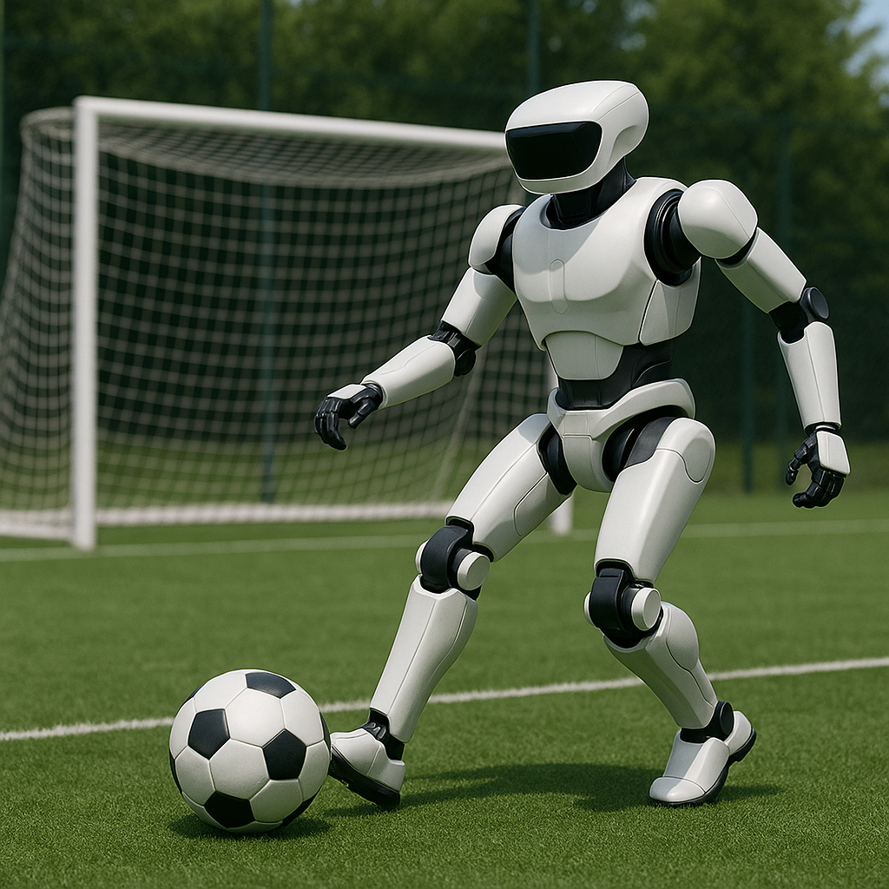

# AUTOMATA-Humanoid-robotics-system-design

## Project Overview

`AUTOMATA-Humanoid-robotics-system-design` is a research- and application-oriented humanoid robotics system project. It aims to develop advanced perception, locomotion, and planning capabilities, with a special focus on the RoboCup humanoid footall scenario. The project integrates multiple core modules and provides a unified framework for complex real-world tasks.

| Module                         | Description                                                                                         | Repository Link                         |
|--------------------------------|-----------------------------------------------------------------------------------------------------|----------------------------------------|
| Intro                          | Overall system architecture and integration design, building a unified framework for complex tasks. | [Intro](https://github.com/NieRNiu/AUTOMATA-Humanoid-robotics-system-design/tree/main/g1%20Intro)               |
| RL-based locomotion            | Reinforcement learning-based locomotion and motion control strategies for humanoid robots.          | [RL-based locomotion](https://github.com/NieRNiu/AUTOMATA-Humanoid-robotics-system-design/tree/main/g1%20RL%20based%20Locomotion) |
| Localization and mapping       | Self-localization and environment mapping for accurate navigation in dynamic environments.          | [Localization and mapping](https://github.com/NieRNiu/AUTOMATA-Humanoid-robotics-system-design/tree/main/g1%20Localization%20and%20Mapping) |
| Planning                       | Path planning and task-level decision-making algorithms for real-time dynamic scenarios.           | [Planning](https://github.com/NieRNiu/AUTOMATA-Humanoid-robotics-system-design/tree/main/g1%20Planning)         |
| Realsense perception system    | Ongoing ...... | -- |
| Visual spatial localization  | Ongoing ...... | -- |
| Vision-language applications   | Ongoing ...... | -- |

---

## System Architecture

<!-- Insert your system architecture or illustrative diagram here -->


---

## Installation

```bash
# Clone this repository
git clone https://github.com/yourusername/AUTOMATA-Humanoid-robotics-system-design.git
cd AUTOMATA-Humanoid-robotics-system-design

 
